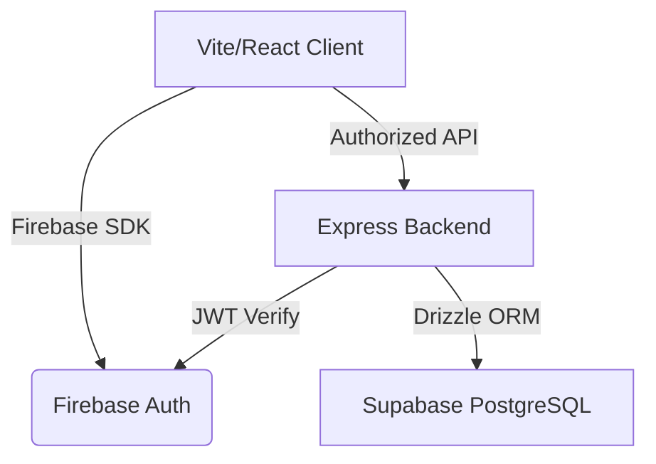

# FinanceDash — Smart Wealth Management 💰

A premium, full-stack financial management platform designed for high-end data tracking and visualization. Built with a modern **Soft-UI & Glassmorphism** aesthetic, featuring secure multi-role authentication and interactive analytics.

## 🚀 Live Production
- **URL**: [https://login-1-opal.vercel.app/](https://login-1-opal.vercel.app/)

## 🎨 UI Inspiration
- **Design Reference**: [Personal Finance Dashboard by Fireart Studio (Dribbble)](https://dribbble.com/shots/23457131-Personal-Finance-Dashboard)
- **Aesthetic**: Minimalist Soft-UI with high-impact typography and breathing space.

## ✨ Key Pillar Features

### 💎 Modern Glassmorphism UI
- **Premium Aesthetics**: Sophisticated "Indigo & Slate" palette with real-time backdrop-blur effects.
- **Fluid Animations**: High-performance micro-interactions and view transitions powered by **Framer Motion**.
- **Responsive Layout**: Designed for both desktop and mobile financial tracking.

### 📊 Interactive Analytics (Recharts)
- **Financial Trends**: Area charts showing 6-month historical balance and volume trends.
- **Spending Breakdown**: Categorical analysis using high-contrast, data-driven bar charts.
- **Real-time Summaries**: Aggregated dashboard statistics for Balance, Revenue, and Costs.

### 🛡️ Robust Security & RBAC
- **Multi-Role Enforcement**:
  - **ADMIN**: Full management (Read/Write/Delete) for all transactions.
  - **ANALYST**: Advanced analytics access and transaction filtering.
  - **VIEWER**: Read-only access to dashboard and personal records.
- **Internal User Sync**: Automated synchronization between Firebase Authentication and PostgreSQL via Drizzle ORM.

## 🛠️ Technology Stack

### Frontend
- **Framework**: React 18 + Vite (TypeScript)
- **Styling**: Vanilla CSS (Custom Glassmorphism Design System)
- **Animations**: Framer Motion
- **Charts**: Recharts
- **Icons**: Lucide-React
- **State**: Firebase Auth Context

### Backend
- **Runtime**: Node.js + Express (TypeScript)
- **Database**: PostgreSQL (Supabase)
- **ORM**: Drizzle ORM
- **Security**: Firebase Admin SDK (JWT Validation)
- **Deployment**: Vercel Serverless Functions

## ⚙️ Configuration & Environment

### Prerequisites
- Node.js (v18+)
- Firebase Account
- Supabase Project

### Environment Variables
Create a `.env` file in the root directory:

```env
# Database Connections
DATABASE_URL="postgresql://..." # Postfix with ?pgbouncer=true
DIRECT_URL="postgresql://..."   # Direct connection string

# Firebase Admin SDK
FIREBASE_PROJECT_ID="..."
FIREBASE_CLIENT_EMAIL="..."
FIREBASE_PRIVATE_KEY="..."

# Access Control Configuration
ADMIN_EMAILS="admin@example.com"

# Frontend (VITE_ prefix required)
VITE_FIREBASE_API_KEY="..."
VITE_FIREBASE_AUTH_DOMAIN="..."
VITE_FIREBASE_PROJECT_ID="..."
# ... rest of firebase config
```

### Quick Start
1. **Clone & Install**:
   ```bash
   npm install && cd frontend && npm install && cd ..
   ```
2. **Development**:
   ```bash
   npm run dev
   ```

## 🏗️ Project Architecture



- **`src/`**: Backend API Layer
  - `/routes`: `dashboard.ts` (Aggregations), `records.ts` (CRUD + RBAC)
  - `/middleware`: `authMiddleware.ts` (Firebase Validation)
- **`frontend/src/`**: Client Layer
  - `/components`: `Dashboard` (Visualizations), `Records` (Glassmorphic Table)
  - `/index.css`: Implementation of the Glassmorphism Design System

## 📄 License
Demonstration project. All rights reserved.
