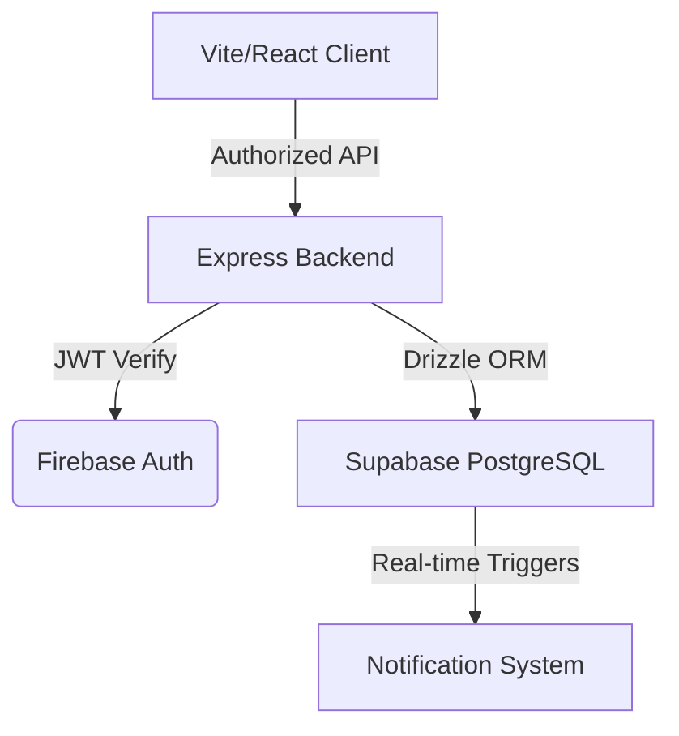

# FinanceDash — Smart Wealth Management 💰

A premium, full-stack financial management platform designed for high-end data tracking and visualization. Built with a modern **Soft-UI & Glassmorphism** aesthetic, featuring secure multi-role authentication and interactive analytics.

## Live Production
- **URL**: [https://login-1-opal.vercel.app/](https://login-1-opal.vercel.app/)

## UI Inspiration
- **Design Reference**: [Personal Finance Dashboard by Fireart Studio (Dribbble)](https://dribbble.com/shots/24604163-Personal-Finance-Dashboard)
- **Aesthetic**: Minimalist Soft-UI with high-impact typography and breathing space.

## Key Pillar Features

### Modern Glassmorphism UI
- **Premium Aesthetics**: Sophisticated "Indigo & Slate" palette with real-time backdrop-blur effects.
- **Fluid Animations**: High-performance micro-interactions and view transitions powered by **Framer Motion**.
- **Responsive Layout**: Designed for both desktop and mobile financial tracking.

### Proactive Notification System
- **Real-time Alerts**: Automated notifications for `EXPENSE_ADDED`, `REVENUE_ADDED`, and performance milestones.
- **Financial Guards**: Instant warnings for `HIGH_SPENDING` (>$1000) and `LOW_BALANCE` (<$500).
- **Interactive UI**: Dedicated notification panel with "mark as read" functionality and activity badges.

### Advanced Financial Analytics
- **Multi-Metric Dashboard**: Real-time tracking of Liquidity, Profitability, and Efficiency ratios.
- **Interactive Charts**:
  - **Trends**: Spline area charts for income/expense history.
  - **Distribution**: Premium Donut charts for categorical spending breakdown.
- **Role-Based Perspectives**: Upgraded **Viewer** dashboard with full data visualization in a read-only mode.

### Global Currency Support
- **Dual Currency**: Native support for **USD ($)** and **INR (₹)**.
- **Real-time Exchange**: Integrated conversion rates for accurate cross-currency reporting.
- **Temporal Consistency**: Currency rates are snapshotted at the time of entry to ensure historical data integrity.

### Robust Security & RBAC
- **Multi-Role Enforcement**:
  - **ADMIN**: Full management (Read/Write/Delete) for all transactions and settings.
  - **ANALYST**: Advanced analytics access and transaction optimization.
  - **VIEWER**: Professional read-only access to dashboard and personal records.
- **Direct Auth Integration**: Seamless sync between Firebase Authentication and PostgreSQL via Drizzle ORM.

## Technology Stack

### Frontend
- **Framework**: React 18 + Vite (TypeScript)
- **Styling**: Vanilla CSS (Custom Glassmorphism Design System)
- **Animations**: Framer Motion
- **Charts**: Recharts
- **Icons**: Lucide-React
- **State Management**: React Context + Custom Hooks

### Backend
- **Runtime**: Node.js + Express (TypeScript)
- **Database**: PostgreSQL (Supabase)
- **ORM**: Drizzle ORM
- **Security**: Firebase Admin SDK (JWT Validation)
- **Deployment**: Vercel Serverless Functions

## 🏗️ Project Architecture

- **`src/`**: Backend API Layer
  - `/routes/dashboard.ts`: High-performance data aggregation and trend analysis.
  - `/routes/notifications.ts`: Activity tracking and alert delivery.
  - `/routes/records.ts`: Secure transaction CRUD with currency snapshotting.
- **`frontend/src/`**: Client Layer
  - `/components/Dashboard`: Central intelligence hub with dynamic visualizations.
  - `/components/Notifications`: Context-aware alert management.
  - `/index.css`: Implementation of the Glassmorphism Design System and layout utilities.

## 📄 License
Demonstration project. All rights reserved.
